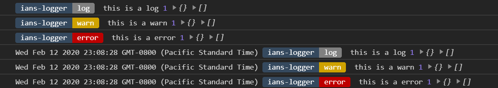

# ians-logger

[docs](http://iansenne.com/ians-logger/docs)

```javascript
import Logger from 'ians-logger'
Logger.log('this is a log', 1, {}, [])
Logger.warn('this is a warn', 1, {}, [])
Logger.error('this is a error', 1, {}, [])
Logger.config.timeStamp = () => new Date().toString()
Logger.log('this is a log', 1, {}, [])
Logger.warn('this is a warn', 1, {}, [])
Logger.error('this is a error', 1, {}, [])
```


